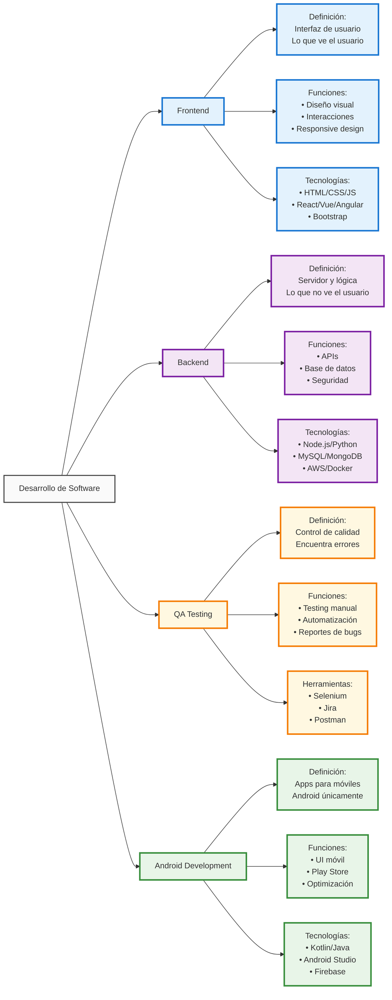
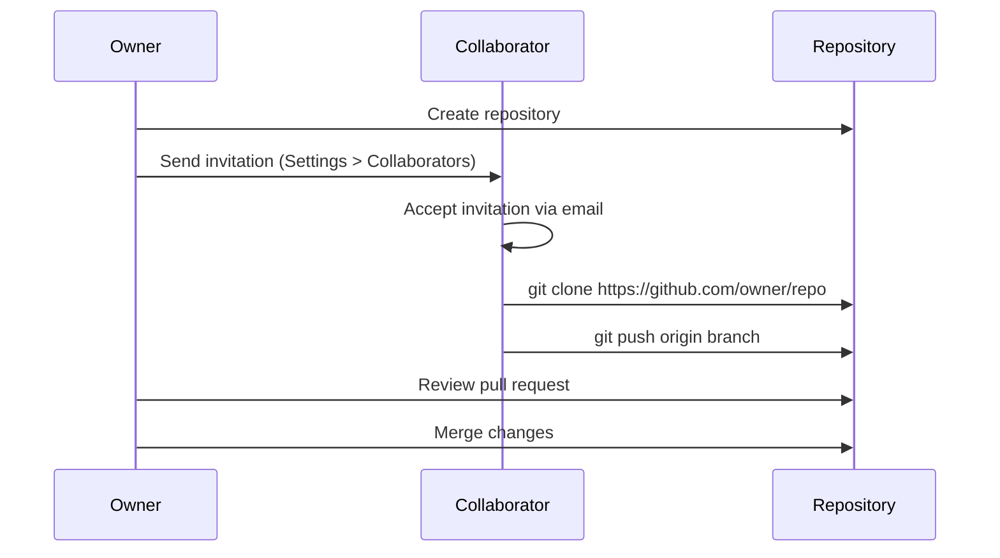

# 📚 Estudio de Roles Básicos en Desarrollo Web y Móvil

##  Recurso Oficial para Aprender Git/GitHub - Para Todos 
https://docs.github.com/es/get-started/start-your-journey/git-and-github-learning-resources

## 0) Integrantes del equipo de estudio y sus responsabilidades en el repositorio

| N° | Nombre Completo | Email | Rol Principal | GitHub Username |
|----|-----------------|-------|---------------|-----------------|
| 0  | JUAREZ BUENO/ Juan Carlos    | jjuarez@unsa.edu.pe | Product Owner | jjuarez29 |
| 1  | CONDORI/CATASI, Jonnier Angel | jonnier@unsa.edu.pe | Project Manager | @jonnier |
| 2  | ACHIRI/CUEVAS, Daniel Cooper | dachiri@unsa.edu.pe | Backend Developer | @AchiriXD |
| 3  | JALA/PARICANAZA, Ronald David | rjala@unsa.edu.pe | Frontend Android Developer | @ronald-0112 |
| 4  | MAQUERA/MUSAJA, Kaled Jair | kaled@unsa.edu.pe | Frontend Android Developer | @kaled |
| 5  | APAZA/QUISPE, Gian Franco | gapazaqui@unsa.edu.pe | Backend Developer | @j3an31 |
| 6  | MEZA/ROMERO, Osmeyer Eddu | osmeyer@unsa.edu.pe | Backend Developer | @osmeyer |
| 7  | VALENCIA/VILCAS, Jose Carlos | jose@unsa.edu.pe | QA Manual/Functional | @jose |
| 8  | ARCANO/GONZALES, Edgard Darick | edgard@unsa.edu.pe | QA Automation/API | @edgard |
| 9  | VERA/SALCEDO, Luis Alberto | luis@unsa.edu.pe | DevOps/SysAdmin | @luis |
| 10 | VICENTE/MEDINA, Eder Lucio | evicentem@unsa.edu.pe | QA Support | evicente3 |
| 11 | YUCRA/TICONIA, Johan Jeremy | jyucrat@unsa.edu.pe | QA Support | johan |
| 12 | CAVERO/ALE, Leonardo Ismael | lcavero@unsa.edu.pe | Frontend Support | Leo-Bv-1 |

## 1) Conceptos Generales para tener en cuenta

### Diferencias entre Librerías, Frameworks y Patrones de Diseño

# ING-SISTEMAS


**Librerías**: Conjunto de funciones que el desarrollador puede usar cuando las necesite.
**Frameworks**: Estructura que define cómo se debe organizar y escribir el código.
**Patrones de Diseño**: Soluciones arquitectónicas probadas para problemas recurrentes.

## 2) Conociendo Git

### ¿Qué es Git?
Git es un sistema de control de versiones distribuido que permite:

- **Versionado local**: Rastrea cambios en archivos y directorios
- **Historial completo**: Mantiene registro de todas las modificaciones
- **Branching**: Permite trabajar en características paralelas
- **Rollback**: Posibilidad de volver a versiones anteriores

### Comandos Git Esenciales
```bash
# Configuración inicial
git config --global user.name "Tu Nombre"
git config --global user.email "tu@email.com"

# Operaciones básicas
git init                    # Inicializar repositorio
git add .                   # Agregar archivos al staging
git commit -m "mensaje"     # Confirmar cambios
git status                  # Ver estado de archivos
git log                     # Ver historial de commits

# Branching
git branch                  # Listar ramas
git checkout -b nueva-rama  # Crear y cambiar a nueva rama
git merge rama              # Fusionar rama
```

## 3) Conociendo GitHub

### Repositorio Remoto
GitHub es una plataforma que aloja repositorios Git en la nube, permitiendo:

- **Colaboración**: Múltiples desarrolladores trabajando juntos
- **Backup**: Respaldo automático del código
- **Integración**: CI/CD, issues, pull requests
- **Documentación**: README, wikis, páginas

### Configuración de Colaboración



### Supervisión de Conflictos
- **Pull antes de Push**: Siempre actualizar antes de subir cambios
- **Branching Strategy**: Usar ramas para características específicas
- **Code Review**: Revisar cambios mediante Pull Requests
- **Merge conflicts**: Resolver manualmente cuando sea necesario

## 4) Desarrollador Frontend

### Descripción del Rol
El desarrollador Frontend es responsable de crear la interfaz de usuario y la experiencia del usuario en aplicaciones web. Se enfoca en todo lo que el usuario ve e interactúa directamente.

### Habilidades Requeridas
- **Técnicas**:
  - HTML5, CSS3, JavaScript (ES6+)
  - Frameworks: React, Vue.js, Angular
  - Preprocesadores CSS: Sass, Less
  - Build tools: Webpack, Vite, Parcel
  - Control de versiones: Git
  - Responsive Design y Mobile-first
  - Accesibilidad web (WCAG)
  - Testing: Jest, Cypress, Testing Library

- **Blandas**:
  - Atención al detalle visual
  - Colaboración con diseñadores UX/UI
  - Comunicación efectiva
  - Adaptabilidad a nuevas tecnologías
  
