# 📚 Estudio de Roles Básicos en Desarrollo Web y Móvil

##  Recurso Oficial para Aprender Git/GitHub - Para Todos 
https://docs.github.com/es/get-started/start-your-journey/git-and-github-learning-resources

## 0) Integrantes del equipo de estudio y sus responsabilidades en el repositorio

| N° | Nombre Completo | Email | Rol Principal | GitHub Username |
|----|-----------------|-------|---------------|-----------------|
| 0  | JUAREZ BUENO/ Juan Carlos    | jjuarez@unsa.edu.pe | Product Owner | jjuarez29 |
| 1  | CONDORI/CATASI, Jonnier Angel | jonnier@unsa.edu.pe | Project Manager | @jonnier |
| 2  | ACHIRI/CUEVAS, Daniel Cooper | dachiri@unsa.edu.pe | Backend Developer | @AchiriXD |
| 3  | JALA/PARICANAZA, Ronald David | rjala@unsa.edu.pe | Frontend Android Developer | @ronald-0112 |
| 4  | MAQUERA/MUSAJA, Kaled Jair | kaled@unsa.edu.pe | Frontend Android Developer | @kaled |
| 5  | APAZA/QUISPE, Gian Franco | gapazaqui@unsa.edu.pe | Backend Developer | @j3an31 |
| 6  | MEZA/ROMERO, Osmeyer Eddu | osmeyer@unsa.edu.pe | Backend Developer | @osmeyer |
| 7  | VALENCIA/VILCAS, Jose Carlos | jose@unsa.edu.pe | QA Manual/Functional | @jose |
| 8  | ARCANO/GONZALES, Edgard Darick | edgard@unsa.edu.pe | QA Automation/API | @edgard |
| 9  | VERA/SALCEDO, Luis Alberto | luis@unsa.edu.pe | DevOps/SysAdmin | @luis |
| 10 | VICENTE/MEDINA, Eder Lucio | evicentem@unsa.edu.pe | QA Support | evicente3 |
| 11 | YUCRA/TICONIA, Johan Jeremy | jyucrat@unsa.edu.pe | QA Support | johan |
| 12 | CAVERO/ALE, Leonardo Ismael | lcavero@unsa.edu.pe | Frontend Support | Leo-Bv-1 |

## 1) Conceptos Generales para tener en cuenta

### Diferencias entre Librerías, Frameworks y Patrones de Diseño

# ING-SISTEMAS

```mermaid

graph LR
    A[Desarrollo de Software] --> B[Frontend]
    A --> C[Backend]
    A --> D[QA Testing]
    A --> E[Android Development]
    
    B --> B1[Definición:<br/>Interfaz de usuario<br/>Lo que ve el usuario]
    B --> B2[Funciones:<br/>• Diseño visual<br/>• Interacciones<br/>• Responsive design]
    B --> B3[Tecnologías:<br/>• HTML/CSS/JS<br/>• React/Vue/Angular<br/>• Bootstrap]
    
    C --> C1[Definición:<br/>Servidor y lógica<br/>Lo que no ve el usuario]
    C --> C2[Funciones:<br/>• APIs<br/>• Base de datos<br/>• Seguridad]
    C --> C3[Tecnologías:<br/>• Node.js/Python<br/>• MySQL/MongoDB<br/>• AWS/Docker]
    
    D --> D1[Definición:<br/>Control de calidad<br/>Encuentra errores]
    D --> D2[Funciones:<br/>• Testing manual<br/>• Automatización<br/>• Reportes de bugs]
    D --> D3[Herramientas:<br/>• Selenium<br/>• Jira<br/>• Postman]
    
    E --> E1[Definición:<br/>Apps para móviles<br/>Android únicamente]
    E --> E2[Funciones:<br/>• UI móvil<br/>• Play Store<br/>• Optimización]
    E --> E3[Tecnologías:<br/>• Kotlin/Java<br/>• Android Studio<br/>• Firebase]
    
    classDef frontend fill:#e3f2fd,stroke:#1976d2,stroke-width:3px
    classDef backend fill:#f3e5f5,stroke:#7b1fa2,stroke-width:3px
    classDef qa fill:#fff8e1,stroke:#f57c00,stroke-width:3px
    classDef android fill:#e8f5e8,stroke:#388e3c,stroke-width:3px
    classDef main fill:#fafafa,stroke:#424242,stroke-width:2px
    
    class A main
    class B,B1,B2,B3 frontend
    class C,C1,C2,C3 backend
    class D,D1,D2,D3 qa
    class E,E1,E2,E3 android
    
    click B "https://platzi.com/blog/que-es-frontend-y-backend/"
    click B1 "https://www.ionos.com/es-us/digitalguide/paginas-web/creacion-de-paginas-web/que-es-el-frontend/"
    click B2 "https://thebridge.tech/blog/desarrollador-front-end-funciones/"
    click B3 "https://www.udemy.com/course/the-complete-web-development-bootcamp/" "Tecnologías Frontend - Udemy"
    
    click C "https://platzi.com/blog/que-es-frontend-y-backend/"
    click C1 " https://www.gluo.mx/blog/backend-que-es-y-para-que-sirve "
    click C2 "https://www.michaelpage.es/advice/profesi%C3%B3n/tecnolog%C3%ADa/perfil-de-backend-developer"
    click C3 "https://www.udemy.com/course/nodejs-the-complete-guide/" "Tecnologías Backend - Udemy"
    
    click D "https://instandart.com/blog/quality-assurance/introduction-to-qa-testing-ensuring-software-excellence/https://instandart.com/blog/quality-assurance/introduction-to-qa-testing-ensuring-software-excellence/"
    click D1 "https://qalified.com/es/blog/que-es-qa-testing/"
    click D2 "https://qalified.com/es/blog/que-hace-un-qa-tester/"
    click D3 "https://qalified.com/es/blog/software-qa-testing-herramientas/"
    
    click E "https://builtin.com/software-engineering-perspectives/android-developmenthttps://builtin.com/software-engineering-perspectives/android-development"
    click E1 "https://keepcoding.io/blog/trabajo-android-developer/"
    click E2 "https://timespro.com/blog/android-developer-job-description"
    click E3 "https://appetiser.com.au/blog/android-app-development-tools/"
```

